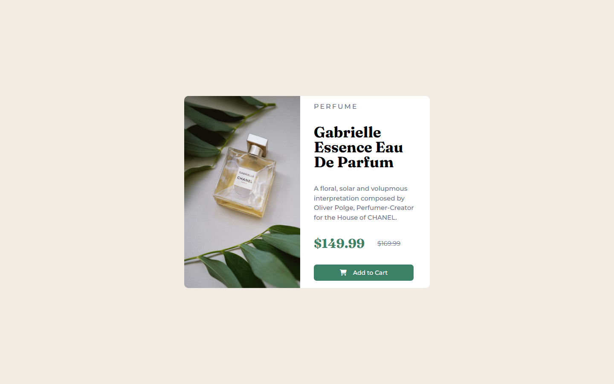

# Frontend Mentor - Product preview card component solution

This is a solution to the [Product preview card component challenge on Frontend Mentor](https://www.frontendmentor.io/challenges/product-preview-card-component-GO7UmttRfa). Frontend Mentor challenges help you improve your coding skills by building realistic projects. 

## Table of contents

- [Overview](#overview)
  - [Screenshot](#screenshot)
  - [Links](#links)
- [My process](#my-process)
  - [Built with](#built-with)
  - [What I learned](#what-i-learned)
  - [Continued development](#continued-development)
- [Author](#author)

## Overview

### Screenshot

### Links

- Live Site URL: [Product Preview Card](https://johnslayk.github.io/product-preview-card-component-main/)

## My process

### Built with

- Semantic HTML5 markup
- CSS custom properties
- Flexbox

### What I learned

- Separating into topics:
- Interact when the mouse cursor is over an object.
- Improve responsiveness according to screen size.
- Start working with CSS variables.

### Continued development

I started a short time ago, I still try to continue learning more about html and css, then pick up to study javascript and try to apply it in some other projects.

## Author

- LinkedIn - [Jonathan WR Silva](https://www.linkedin.com/in/jonathanwslk/)
- Frontend Mentor - [@johnslayk](https://www.frontendmentor.io/profile/johnslayk)
- Twitter - [@johnslayk](https://www.twitter.com/johnslayk)
